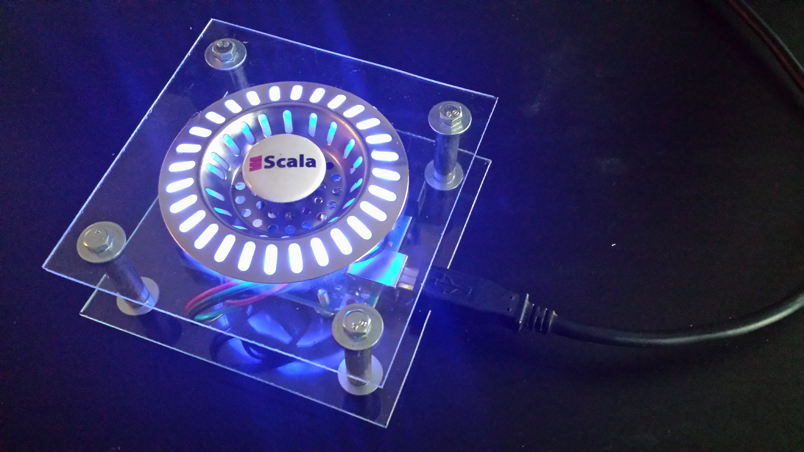

# ControllableDataProducer
A kafka producer that can be controlled used a physical serial connected device (USB)

Usage: `sbt run <kafka broker> <kafka topic>`

This project is meant to be used with a physical controller, like this one:

